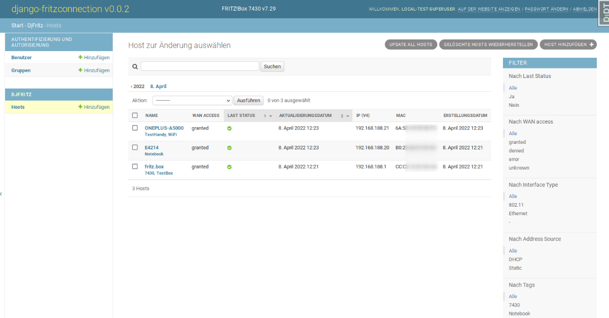

<!--
N.B.: This README was automatically generated by <https://github.com/YunoHost/apps/tree/master/tools/readme_generator>
It shall NOT be edited by hand.
-->

# django-fritzconnection for YunoHost

[](https://ci-apps.yunohost.org/ci/apps/django-fritzconnection/)  

[](https://install-app.yunohost.org/?app=django-fritzconnection)

*[Read this README in other languages.](./ALL_README.md)*

> *This package allows you to install django-fritzconnection quickly and simply on a YunoHost server.*  
> *If you don't have YunoHost, please consult [the guide](https://yunohost.org/install) to learn how to install it.*

## Overview

[](https://github.com/YunoHost-Apps/django-fritzconnection_ynh/actions/workflows/tests.yml)
[](https://app.codecov.io/github/jedie/djfritz_ynh)
[](https://pypi.org/project/djfritz_ynh/)
[](https://github.com/YunoHost-Apps/django-fritzconnection_ynh/blob/main/pyproject.toml)
[](https://github.com/YunoHost-Apps/django-fritzconnection_ynh/blob/main/LICENSE)

Web based FritzBox management using Python/Django and the great [fritzconnection](https://github.com/kbr/fritzconnection) library.

Pull requests welcome ;)

This package for YunoHost used [django-yunohost-integration](https://github.com/YunoHost-Apps/django_yunohost_integration)


**Shipped version:** 0.4.0~ynh1

## Screenshots



## Documentation and resources

- Upstream app code repository: <https://github.com/jedie/django-fritzconnection>
- YunoHost Store: <https://apps.yunohost.org/app/django-fritzconnection>
- Report a bug: <https://github.com/YunoHost-Apps/django-fritzconnection_ynh/issues>

## Developer info

Please send your pull request to the [`testing` branch](https://github.com/YunoHost-Apps/django-fritzconnection_ynh/tree/testing).

To try the `testing` branch, please proceed like that:

```bash
sudo yunohost app install https://github.com/YunoHost-Apps/django-fritzconnection_ynh/tree/testing --debug
or
sudo yunohost app upgrade django-fritzconnection -u https://github.com/YunoHost-Apps/django-fritzconnection_ynh/tree/testing --debug
```

**More info regarding app packaging:** <https://yunohost.org/packaging_apps>
