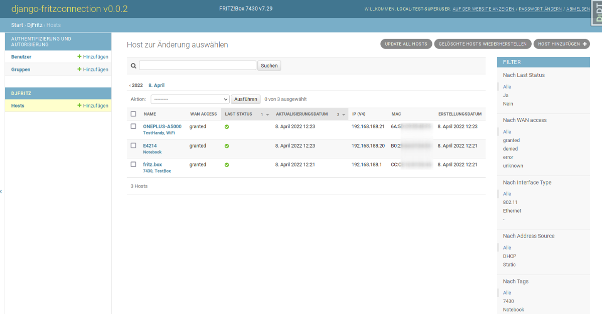

<!--
Ohart ongi: README hau automatikoki sortu da <https://github.com/YunoHost/apps/tree/master/tools/readme_generator>ri esker
EZ editatu eskuz.
-->

# django-fritzconnection YunoHost-erako

[](https://ci-apps.yunohost.org/ci/apps/django-fritzconnection/)


[](https://install-app.yunohost.org/?app=django-fritzconnection)

*[Irakurri README hau beste hizkuntzatan.](./ALL_README.md)*

> *Pakete honek django-fritzconnection YunoHost zerbitzari batean azkar eta zailtasunik gabe instalatzea ahalbidetzen dizu.*  
> *YunoHost ez baduzu, kontsultatu [gida](https://yunohost.org/install) nola instalatu ikasteko.*

## Aurreikuspena

[](https://github.com/YunoHost-Apps/django-fritzconnection_ynh/actions/workflows/tests.yml)
[](https://app.codecov.io/github/jedie/djfritz_ynh)
[](https://pypi.org/project/djfritz_ynh/)
[](https://github.com/YunoHost-Apps/django-fritzconnection_ynh/blob/main/pyproject.toml)
[](https://github.com/YunoHost-Apps/django-fritzconnection_ynh/blob/main/LICENSE)

Web based FritzBox management using Python/Django and the great [fritzconnection](https://github.com/kbr/fritzconnection) library.

Pull requests welcome ;)

This package for YunoHost used [django-yunohost-integration](https://github.com/YunoHost-Apps/django_yunohost_integration)


**Paketatutako bertsioa:** 0.4.0~ynh2

## Pantaila-argazkiak



## Dokumentazioa eta baliabideak

- Jatorrizko aplikazioaren kode-gordailua: <https://github.com/jedie/django-fritzconnection>
- YunoHost Denda: <https://apps.yunohost.org/app/django-fritzconnection>
- Eman errore baten berri: <https://github.com/YunoHost-Apps/django-fritzconnection_ynh/issues>

## Garatzaileentzako informazioa

Bidali `pull request`a [`testing` abarrera](https://github.com/YunoHost-Apps/django-fritzconnection_ynh/tree/testing).

`testing` abarra probatzeko, ondorengoa egin:

```bash
sudo yunohost app install https://github.com/YunoHost-Apps/django-fritzconnection_ynh/tree/testing --debug
edo
sudo yunohost app upgrade django-fritzconnection -u https://github.com/YunoHost-Apps/django-fritzconnection_ynh/tree/testing --debug
```

**Informazio gehiago aplikazioaren paketatzeari buruz:** <https://yunohost.org/packaging_apps>
