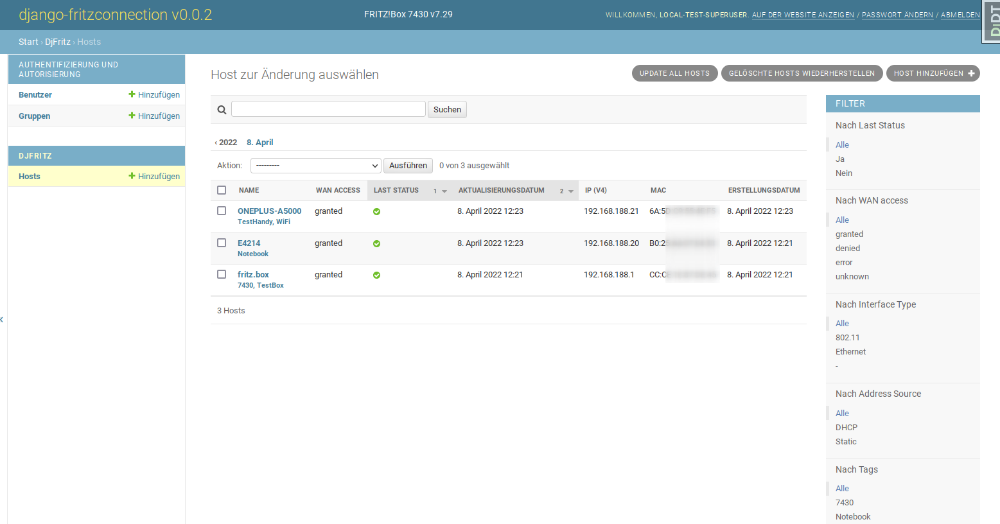

# django-fritzconnection pour YunoHost

[](https://dash.yunohost.org/appci/app/django-fritzconnection)    
[](https://install-app.yunohost.org/?app=django-fritzconnection)

*[Read this readme in english.](./README.md)*
*[Lire ce readme en français.](./README_fr.md)*

> *Ce package vous permet d'installer django-fritzconnection rapidement et simplement sur un serveur YunoHost.
Si vous n'avez pas YunoHost, regardez [ici](https://yunohost.org/#/install) pour savoir comment l'installer et en profiter.*

## Vue d'ensemble

Web based FritzBox management using Python/Django and the great [fritzconnection](https://github.com/kbr/fritzconnection) library.

The basic idea is to block/unblock Internet access to a group of devices as easily as possible.


[](https://github.com/YunoHost-Apps/django-fritzconnection_ynh/actions/workflows/pytest.yml) [](https://github.com/YunoHost-Apps/django-fritzconnection_ynh/actions/workflows/package_linter.yml) [](https://codecov.io/gh/YunoHost-Apps/django-fritzconnection_ynh)


Pull requests welcome ;)

This package for YunoHost used [django-yunohost-integration](https://github.com/YunoHost-Apps/django_yunohost_integration)


**Version incluse :** 0.1.0.rc1~ynh1


## Captures d'écran




## Avertissements / informations importantes

## Settings and upgrades

Almost everything related to django-fritzconnection's configuration is handled in a `"../conf/settings.py"` file.
You can edit the file `/opt/yunohost/django-fritzconnection/local_settings.py` to enable or disable features.

Test sending emails:

```bash
ssh admin@yourdomain.tld
root@yunohost:~# cd /opt/yunohost/django-fritzconnection/
root@yunohost:/opt/yunohost/django-fritzconnection# source venv/bin/activate
(venv) root@yunohost:/opt/yunohost/django-fritzconnection# ./manage.py sendtestemail --admins
```

Background info: Error mails are send to all [settings.ADMINS](https://docs.djangoproject.com/en/2.2/ref/settings/#std:setting-ADMINS). By default the YunoHost admin is inserted here.
To check current ADMINS run:

```bash
(venv) root@yunohost:/opt/yunohost/django-fritzconnection# ./manage.py sendtestemail --admins
```

If you prefere to send error emails to a extrnal email address, just do something like this:

```bash
echo "ADMINS = (('Your Name', 'example@domain.tld'),)" >> /opt/yunohost/django-fritzconnection/local_settings.py
```

To check the effective settings, run this:
```bash
(venv) root@yunohost:/opt/yunohost/django-fritzconnection# ./manage.py diffsettings
```


# Miscellaneous


## SSO authentication

[SSOwat](https://github.com/YunoHost/SSOwat) is fully supported via [django-yunohost-integration](https://github.com/YunoHost-Apps/django_yunohost_integration):

* First user (`$YNH_APP_ARG_ADMIN`) will be created as Django's super user
* All new users will be created as normal users
* Login via SSO is fully supported
* User Email, First / Last name will be updated from SSO data


---

# Yunohost developer commands

To remove call e.g.:
```bash
sudo yunohost app remove django-fritzconnection
```

Backup / remove / restore cycle, e.g.:
```bash
yunohost backup create --apps django-fritzconnection
yunohost backup list
archives:
  - django-fritzconnection-pre-upgrade1
  - 20201223-163434
yunohost app remove django-fritzconnection
yunohost backup restore 20201223-163434 --apps django-fritzconnection
```

Debug installation, e.g.:
```bash
root@yunohost:~# ls -la /var/www/django-fritzconnection/
total 18
drwxr-xr-x 4 root root 4 Dec  8 08:36 .
drwxr-xr-x 6 root root 6 Dec  8 08:36 ..
drwxr-xr-x 2 root root 2 Dec  8 08:36 media
drwxr-xr-x 7 root root 8 Dec  8 08:40 static

root@yunohost:~# ls -la /opt/yunohost/django-fritzconnection/
total 58
drwxr-xr-x 5 django-fritzconnection django-fritzconnection   11 Dec  8 08:39 .
drwxr-xr-x 3 root        root           3 Dec  8 08:36 ..
-rw-r--r-- 1 django-fritzconnection django-fritzconnection  460 Dec  8 08:39 gunicorn.conf.py
-rw-r--r-- 1 django-fritzconnection django-fritzconnection    0 Dec  8 08:39 local_settings.py
-rwxr-xr-x 1 django-fritzconnection django-fritzconnection  274 Dec  8 08:39 manage.py
-rw-r--r-- 1 django-fritzconnection django-fritzconnection  171 Dec  8 08:39 secret.txt
drwxr-xr-x 6 django-fritzconnection django-fritzconnection    6 Dec  8 08:37 venv
-rw-r--r-- 1 django-fritzconnection django-fritzconnection  115 Dec  8 08:39 wsgi.py
-rw-r--r-- 1 django-fritzconnection django-fritzconnection 4737 Dec  8 08:39 settings.py

root@yunohost:~# cd /opt/yunohost/django-fritzconnection/
root@yunohost:/opt/yunohost/django-fritzconnection# source venv/bin/activate
(venv) root@yunohost:/opt/yunohost/django-fritzconnection# ./manage.py check
django-fritzconnection v0.8.2 (Django v2.2.17)
DJANGO_SETTINGS_MODULE='settings'
PROJECT_PATH:/opt/yunohost/django-fritzconnection/venv/lib/python3.7/site-packages
BASE_PATH:/opt/yunohost/django-fritzconnection
System check identified no issues (0 silenced).

root@yunohost:~# tail -f /var/log/django-fritzconnection/django-fritzconnection.log
root@yunohost:~# cat /etc/systemd/system/django-fritzconnection.service

root@yunohost:~# systemctl reload-or-restart django-fritzconnection
root@yunohost:~# journalctl --unit=django-fritzconnection --follow
```

## local test

For quicker developing of django-fritzconnection in the context of YunoHost app,
it's possible to run the Django developer server with the settings
and urls made for YunoHost installation.

e.g.:
```bash
~$ git clone https://github.com/YunoHost-Apps/django-fritzconnection_ynh.git
~$ cd django-fritzconnection_ynh/
~/django-fritzconnection_ynh$ make
install-poetry         install or update poetry
install                install django-fritzconnection via poetry
update                 update the sources and installation
local-test             Run local_test.py to run django-fritzconnection_ynh locally
~/django-fritzconnection_ynh$ make install-poetry
~/django-fritzconnection_ynh$ make install
~/django-fritzconnection_ynh$ make local-test
```

Notes:

* SQlite database will be used
* A super user with username `test` and password `test` is created
* The page is available under `http://127.0.0.1:8000/app_path/`

## Documentations et ressources

* Site officiel de l'app : https://github.com/jedie/django-fritzconnection
* Dépôt de code officiel de l'app : https://github.com/jedie/django-fritzconnection
* Documentation YunoHost pour cette app : https://yunohost.org/app_django-fritzconnection
* Signaler un bug : https://github.com/YunoHost-Apps/django-fritzconnection_ynh/issues

## Informations pour les développeurs

Merci de faire vos pull request sur la [branche testing](https://github.com/YunoHost-Apps/django-fritzconnection_ynh/tree/testing).

Pour essayer la branche testing, procédez comme suit.
```
sudo yunohost app install https://github.com/YunoHost-Apps/django-fritzconnection_ynh/tree/testing --debug
ou
sudo yunohost app upgrade django-fritzconnection -u https://github.com/YunoHost-Apps/django-fritzconnection_ynh/tree/testing --debug
```

**Plus d'infos sur le packaging d'applications :** https://yunohost.org/packaging_apps